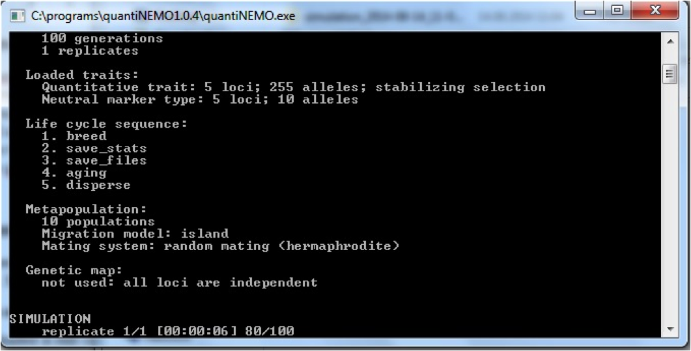
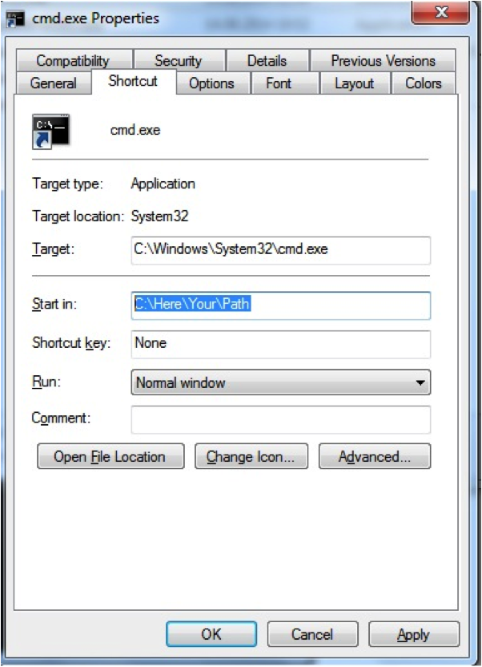
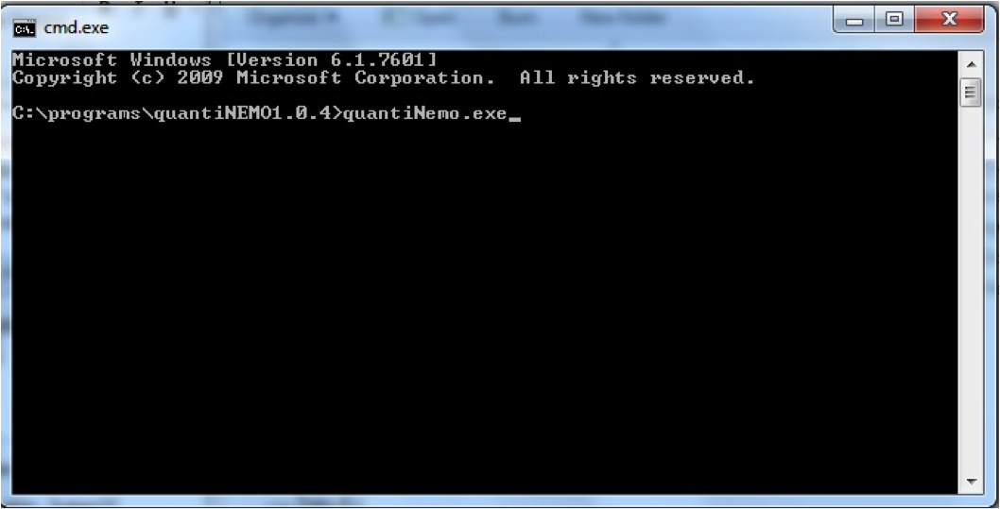

---
title: "Getting started"
date: "20 novembre 2017"
--- 

        
## Some first notes    
Welcome to the quantiNemo tutorial series. QuantiNemo is a software that allows you to simulate structured populations of individuals with genotypes, phenotypes, migration, selection and much more. It is an incredibly exhaustive software that allows the simulation of an extreme diverse range of biological scenarios, both forwards and backwards in time (see the different vignettes on this website for some examples). However, the basics of quantiNemo are very simple. The following four tutorials will demonstrate some of the functionalities of quantiNemo, giving you the basic skills that will allow you to later build your own more complex scenarios.    

Though the manual provides all information you would need to successfully use quantiNemo, do not read it yet. These tutorials will give you a head start. You will see that throughout these tutorials we do refer to specific sections in the manual if you would like to know more about certain functionality of the quantiNemo software. During the tutorial, quantiNemo will often be abbreviated as 'qN'. 

This tutorial was written to work with quantiNemo version 2.0. Though most of the tutorial should work fine under other versions, it might differ in some, important, details such as parameter encoding.   

We recommend you not to copy-paste sample code from this tutorial into a setup file, since this can often introduce 'hidden' errors, but instead retype the text (the mastering of any art starts by copying it). However, all setup files (files ending with .ini) described and used during these tutorials can be downloaded from this website directly [here](https://www2.unil.ch/popgen/softwares/quantinemo/). Furthermore, many of the visualisations and analyses after the simulations have been performed in the statistical software package R. Though some of the first plotting exercises can be performed in Excel, data manipulations later in this tutorial require the aid of the more flexible environment of R.   

Because the scope here is not to explain the workings of R (there are excellent online tutorials for those), we do not go into too much detail and instead provide readymade R-scripts. However, we recommend those who do know R to first try reading and analysing the data yourself.

All the input files and the R notebook used to generate the tutorial including the plot can be downloaded [here](files/inputfile.zip)

## 0 Getting started
QuantiNEMO is freely distributed and can be easily downloaded from the internet, for example [here](index.html#download). Several versions exist, including the source code, but we need an executable version. Make sure you download the version suitable for your operating system (Linux, Mac or Windows). After downloading, see the section corresponding to your operating system for your first instructions.

### 0.1  Basic usage on a Windows machine
The file you downloaded is still compressed as a zip-file. Unzip it to a location where you would like qN to run. Inside the folder, you will find three items: the manual (a pdf-file), the application (or 'executable' ending on .exe), and a setup file named 'quantiNemo.ini'.  

N.B. It may be that your version of windows does not show the extension (.exe .pdf) of all items. If you want to change that, got to `Control Panel > Appearance and Personalization > Folder Options`; go to the `View` tab; under `Advanced settings` untick 'Hide extensions for known file types' and click OK.    

This tutorial will often refer to certain sections in the manual so it will be good to keep it at hand. The executable is the actual program. Double click it. A black command prompt window will have opened which shows some text on screen including with on the bottom 'replicate 1/1' with a timer and a fraction of hundred counting up (see figure below).   

    
 
Once the counter reaches 1000, the window will disappear again.   

The simulation has functioned perfectly, but at times the immediate disappearance of the prompt can be inconvenient when you want to read e.g. error messages. There is a trick to keep the prompt open by not launching quantinemo.exe directly, but via the command prompt: Right-click in the folder with the qN executable (not on an icon), go to New > Shortcut. Type instead of a file path `cmd.exe`, click `Next` and then `Finish`. A new shortcut appears in your folder. Right-click this shortcut and go to `Properties`. In the Properties window, change the `Start in` path to the path where your current folder with the qN-files reside and click OK.    

      
  
When you now click the `cmd.exe` shortcut, a command prompt opens with as a top line the path of your current folder (the qN folder). If you want to launch qN just type quantiNemo.exe   

    
 
When you press enter, qN will launch itself again, just as before. The big difference, however, is that the prompt stays open after finishing!    

You may have noticed that while running qN twice, two new folders have appeared within the qN folder, both whose names start with 'simulation_'' You may delete these two folders for now.    

In the next part of the tutorial, we will use personalized input files. In this case, you have to launch the executable followed by the name of the input file: `quantinemo.exe my_input_file.ini`. For now, you can delete or rename the file 'quantiNemo.ini' to make sure that you don't use it by mistake. 

### 0.2 Basic usage on a MAC
Drag and extract the downloaded 'quantinemo_mac.zip' file to a location where you would like qN to run and extract it. Inside your qN folder, you will find three items: the manual (the pdf-file), a setup file named 'quanitNemo.ini' and the application (or executable) itself, with no extension. This tutorial will often refer to certain sections in the manual so it will be good to keep it at hand. The setup file we will ignore for the moment.    

To launch quantiNemo, you need to start a terminal (to do so, click the search button of Mac Os, type `terminal`, and then hit Enter),here go to the correct folder by typing `cd /Users/your_user_name/pathtoquantinemo` and then typing the command `./quantinemo`. When you press enter, qN will launch itself, starting a simulation with the parameters contained in the setup file 'quantiNemo.ini'.Two new folders appear within the qN folder, containing the result of the simulation. You can have a look at them, and then delete them since we don't need them for now. 

In the next part of the tutorial, we will use personalized input files. In this case, you have to launch the executable followed by the name of the input file: `./quantinemo my_input_file.ini`. For now, you can delete or rename the file 'quantiNemo.ini' to make sure that you don't use it by mistake. 

### 0.3 Basic usage in Linux
Drag and extract the downloaded 'quantinemo_linux.zip' file to a location where you would like qN to run and extract it. Inside your qN folder, you will find three items: the manual (the pdf-file), a setup file named 'quantiNemo.ini' and the application (or executable) itself, with no extension. This tutorial will often refer to certain sections in the manual so it will be good to keep it at hand. The setup file we will ignore for the moment.    

To launch quantiNemo, you need to start a terminal, go to the correct folder by typing `cd /home/your_user_name/pathtoquantinemo` and then typing the command `./quantinemo`. When you press enter, qN will launch itself, starting a simulation with the parameters contained in the setup file 'quantiNemo.ini'.Two new folders have appeared within the qN folder, containing the result of the simulation. You can have a look at them, and then delete them since we don't need them for now. 

In the next part of the tutorial, we will use personalized input files. In this case, you have to launch the executable followed by the name of the input file: `./quantinemo my_input_file.ini`. For now, you can delete or rename the file 'quantiNemo.ini' to make sure that you don't use it by mistake. 

